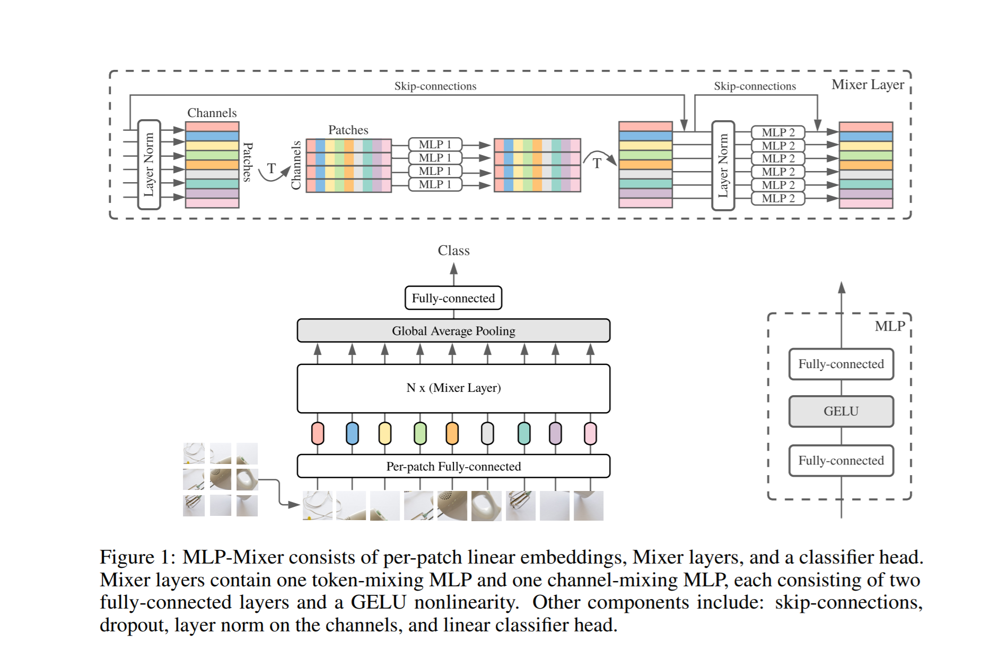

# MLP-Mixer: An all-MLP Architecture for Vision
This repo contains PyTorch implementation of [MLP-Mixer: An all-MLP Architecture for Vision](https://arxiv.org/abs/2105.01601).



## Usage :
```python
import torch
import numpy as np
from mlp-mixer import MLPMixer

img = torch.ones([1, 3, 224, 224])

model = MLPMixer(in_channels=3, image_size=224, patch_size=16, num_classes=1000,
                 dim=512, depth=8, token_dim=256, channel_dim=2048)

parameters = filter(lambda p: p.requires_grad, model.parameters())
parameters = sum([np.prod(p.size()) for p in parameters]) / 1_000_000
print('Trainable Parameters: %.3fM' % parameters)

out_img = model(img)

print("Shape of out :", out_img.shape)  # [B, in_channels, image_size, image_size]
```

## Citation : 
```
@misc{tolstikhin2021mlpmixer,
      title={MLP-Mixer: An all-MLP Architecture for Vision}, 
      author={Ilya Tolstikhin and Neil Houlsby and Alexander Kolesnikov and Lucas Beyer and Xiaohua Zhai and Thomas Unterthiner and Jessica Yung and Daniel Keysers and Jakob Uszkoreit and Mario Lucic and Alexey Dosovitskiy},
      year={2021},
      eprint={2105.01601},
      archivePrefix={arXiv},
      primaryClass={cs.CV}
}
```

## Acknowledgement :
* Some component borrowed from ViT code of  [@lucidrains](https://github.com/lucidrains) repo : https://github.com/lucidrains/vit-pytorch
